# Remedial PAW - Library Management System with Geolocation

Aplikasi web manajemen perpustakaan sederhana yang dibangun menggunakan Node.js (Backend) dan Vanilla JavaScript (Frontend). Aplikasi ini memiliki fitur peminjaman buku berbasis lokasi (Geolocation API) dan pembedaan hak akses antara **Admin**, **User**, dan **Guest**.

---

## 📋 Fitur Utama
1.  **Role-Based Access Control:**
    * **Guest:** Hanya bisa melihat daftar dan detail buku.
    * **User:** Bisa meminjam buku (wajib menyertakan Nama & Lokasi GPS).
    * **Admin:** Bisa menambah, mengedit, menghapus buku, dan melihat Log Peminjaman.
2.  **Geolocation Tracking:** Sistem mencatat koordinat (Latitude & Longitude) pengguna saat meminjam buku.
3.  **CRUD Management:** Pengelolaan data buku yang lengkap (Create, Read, Update, Delete).

## 🛠️ Teknologi yang Digunakan
* **Backend:** Node.js, Express.js
* **Database:** MySQL (Sequelize ORM)
* **Frontend:** HTML5, Bootstrap 5, Vanilla JS, SweetAlert2
* **Tools:** Postman (API Testing)

---

## 📸 Dokumentasi & Screenshot Aplikasi

Berikut adalah tampilan antarmuka dan bukti pengujian fungsi aplikasi.

### A. Tampilan Frontend (Interface)

#### 1. Dashboard & Guest Mode
Halaman utama saat pertama kali dibuka.
* **Dashboard Guest:** Pengunjung yang belum login memiliki akses terbatas.
    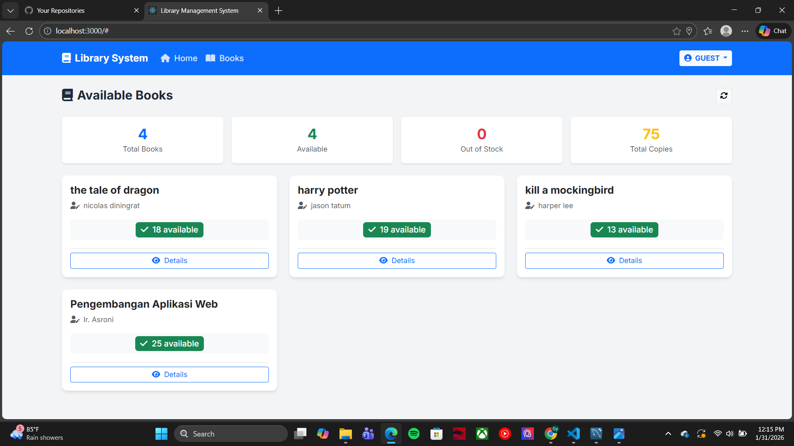
* **Detail Buku (Guest):** Tamu hanya bisa melihat info buku tanpa tombol aksi.
    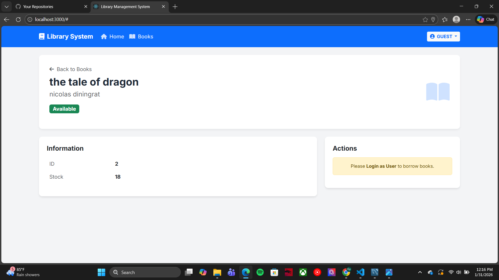

#### 2. User Mode (Peminjam)
Tampilan untuk pengguna yang ingin meminjam buku.
* **Dashboard User:** Menampilkan menu Geolocation Tracking yang aktif.
    
* **Halaman Daftar Buku (User):** Tersedia tombol "Borrow" berwarna hijau.
    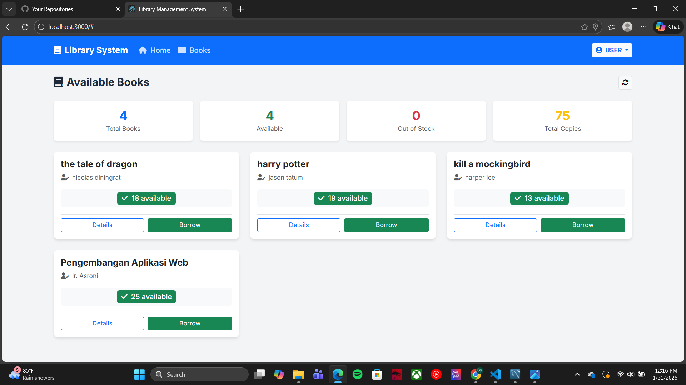
* **Form Peminjaman (Geolocation):** User wajib mengisi nama dan mendeteksi lokasi GPS sebelum meminjam.
    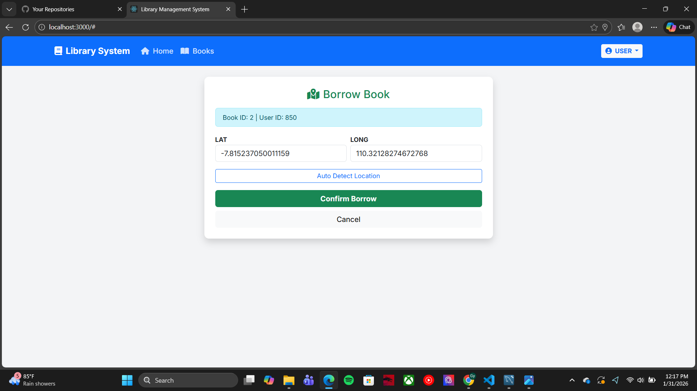

#### 3. Admin Mode (Pengelola)
Tampilan khusus administrator untuk mengelola sistem.
* **Dashboard Admin:** Menampilkan ringkasan sistem.
    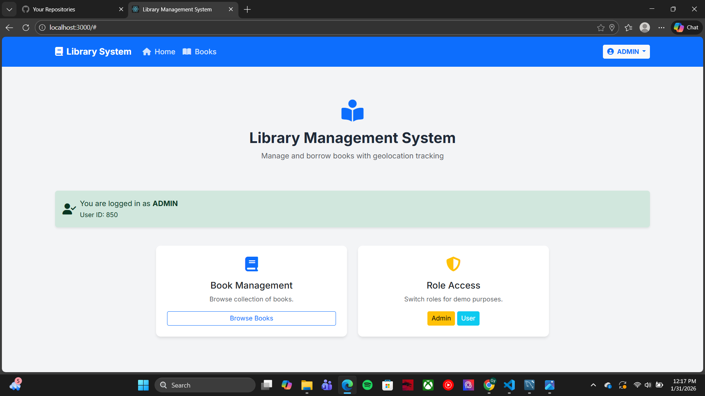
* **Halaman Daftar Buku (Admin):** Tersedia tombol aksi **Edit** (Kuning) dan **Delete** (Merah).
    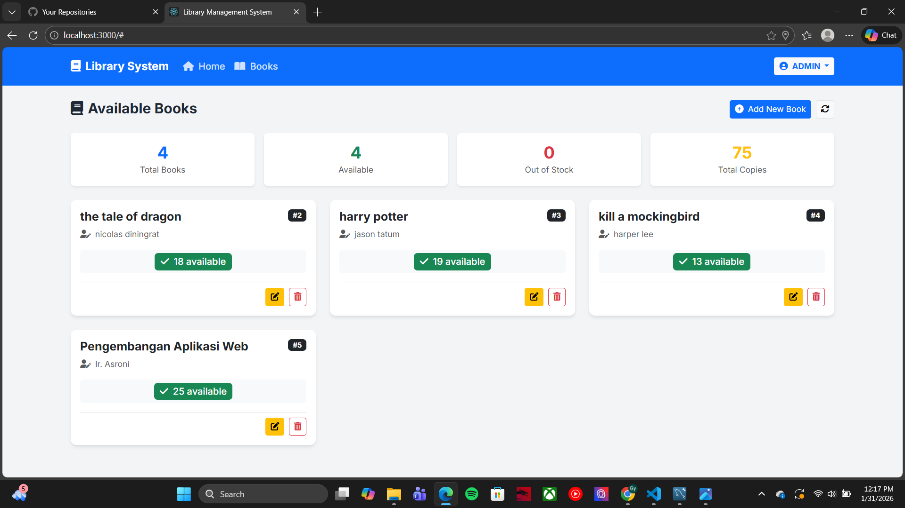
* **Tambah Buku Baru:** Form untuk memasukkan data buku ke database.
    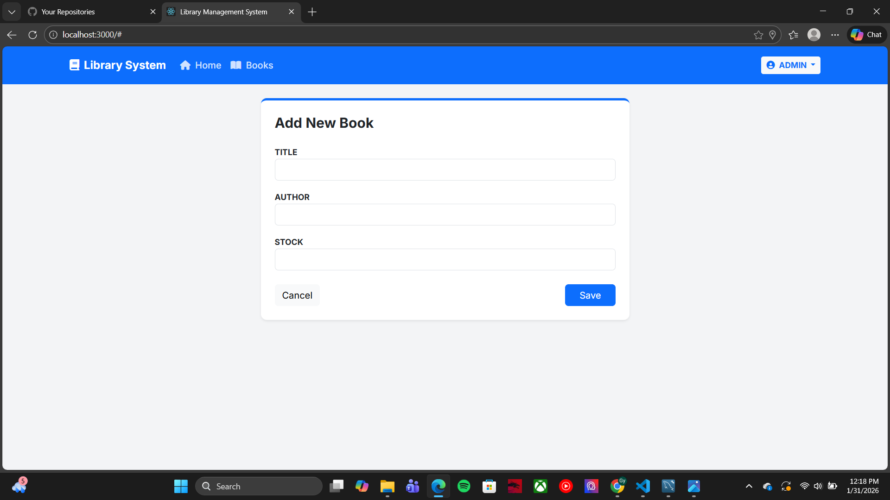
* **Edit Data Buku:** Form untuk memperbarui informasi buku yang sudah ada.
    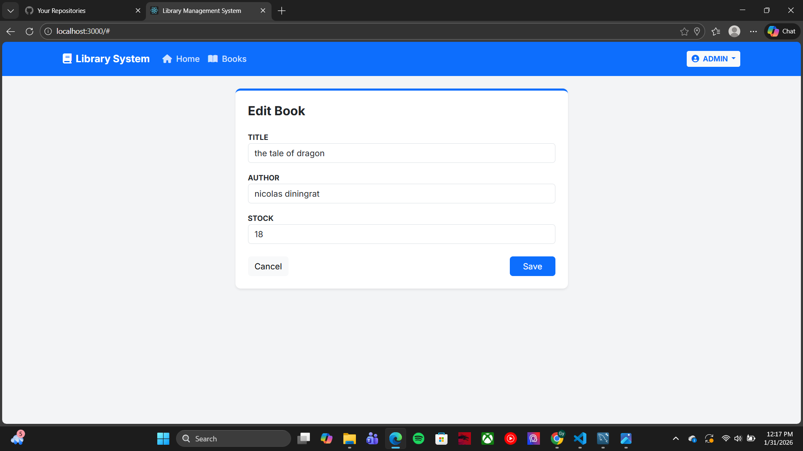

---

### B. Pengujian Backend (API Testing via Postman)

Bukti bahwa API Backend berfungsi dengan baik sebelum dihubungkan ke Frontend.

1.  **Tambah Buku (POST):** Admin berhasil menambahkan buku baru ke database.
    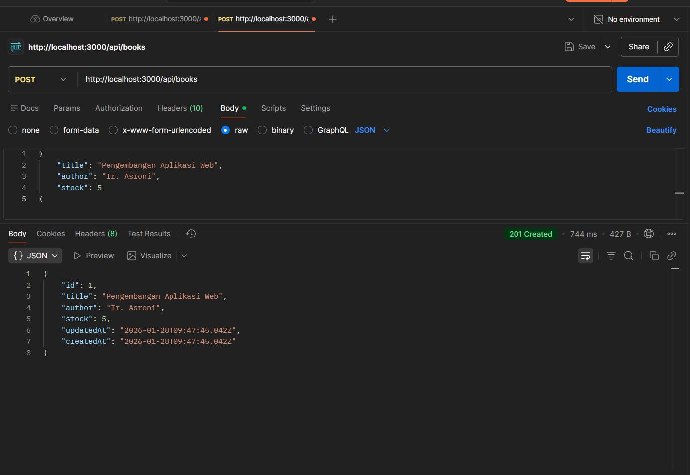
2.  **Update Buku (PUT):** Admin berhasil mengubah data stok atau judul buku.
    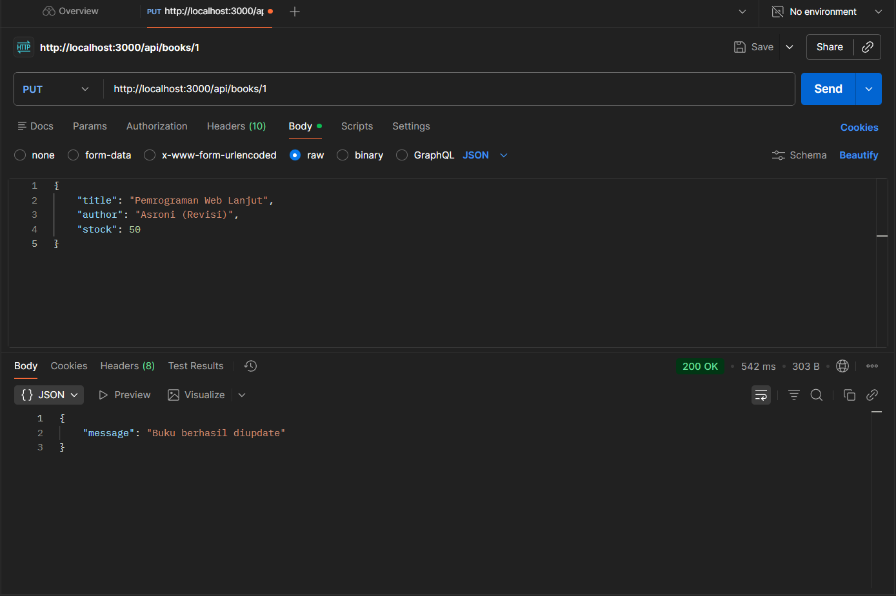
3.  **Hapus Buku (DELETE):** Admin menghapus buku dari sistem.
    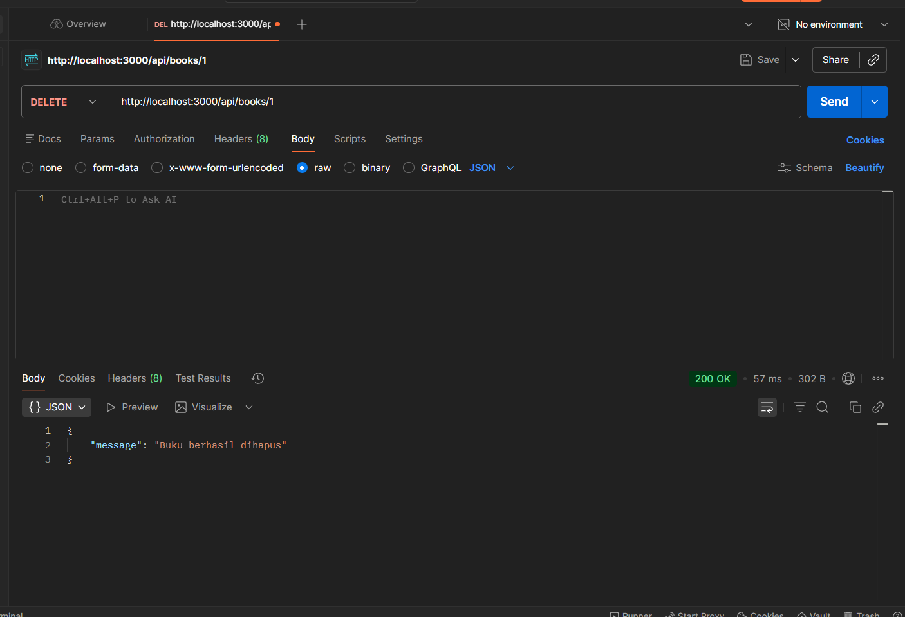
4.  **Pinjam Buku (POST):** Simulasi user meminjam buku dengan mengirimkan data koordinat.
    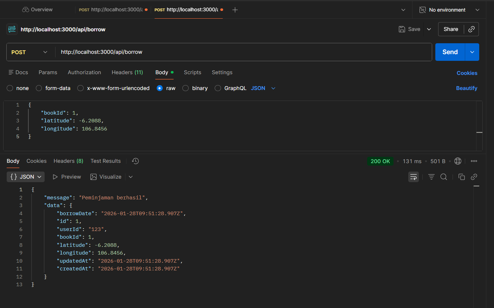

---

### C. Struktur Database (MySQL)

Data tersimpan secara otomatis menggunakan Sequelize ORM.

1.  **Tabel Books:** Menyimpan data ID, Judul, Penulis, dan Stok.
    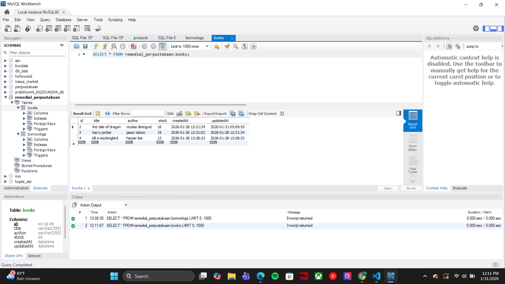
2.  **Tabel BorrowLogs:** Menyimpan riwayat peminjaman, nama peminjam, dan koordinat lokasi.
    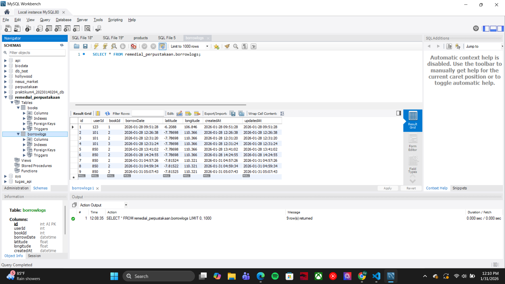

---

## 🚀 Cara Menjalankan Project

1.  **Clone/Download** repository ini.
2.  **Install Dependencies:**
    ```bash
    npm install
    ```
3.  **Setup Database:**
    * Buat database di MySQL bernama `remedial_perpustakaan`.
    * Sesuaikan user/password di file `config/database.js`.
4.  **Jalankan Server:**
    ```bash
    node app.js
    ```
5.  **Buka Aplikasi:**
    Akses `http://localhost:3000` di browser Anda.

---
**Disusun Oleh:**
Nama: M. Gyan Hendriansyah
NIM: 20230140204
Mata Kuliah: Pengembangan Aplikasi Web